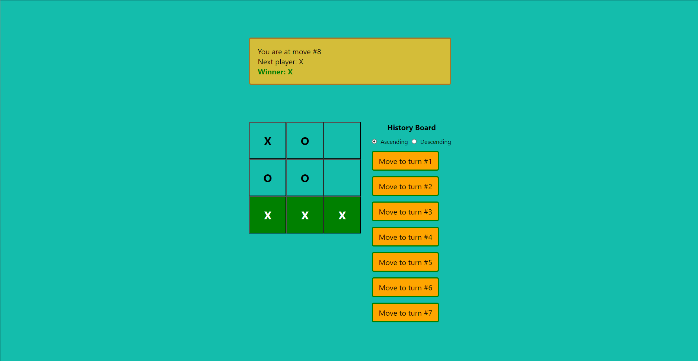

# Link following:
[Github](https://github.com/minhtrifit/web-advanced-tic-tac-toe) 
[Netlify Hosting](https://20120217-tic-tac-toe.netlify.app)

# Project Requirement:
For the current move only, show “You are at move #…” instead of a button: 1.8 points. (Done)

Rewrite the Board to use two loops to make the squares instead of hardcoding them: 1.8 points. (Done)

Add a toggle button that lets you sort the moves in either ascending or descending order: 1.8 points.

When someone wins, highlight the three squares that caused the win (and when no one wins, display a message about the result being a draw): 1.8 points. (Done)

Display the location for each move in the format (row, col) in the move history list: 1.8 points. (Done)

Upload to a public host: 1 point (Done)

# Project Showcase

